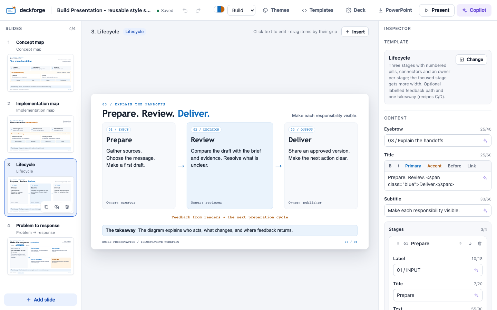
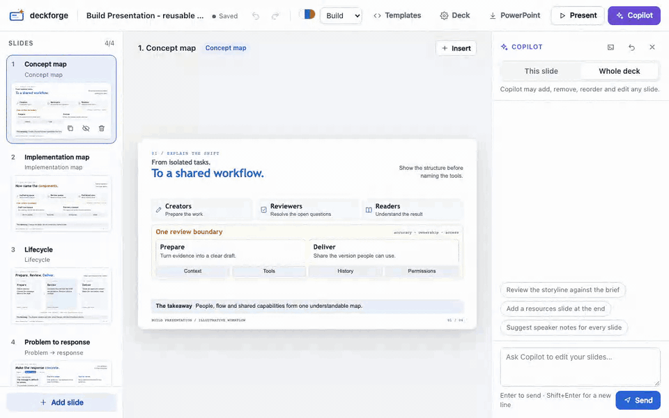

<p align="center">
  
</p>

<h1 align="center">deckforge</h1>

<p align="center">
  <strong>Agent-native presentations.</strong> Typed slides an AI can edit safely, on the Copilot you already have.
</p>

<p align="center">
  <a href="https://github.com/lrivallain/deckforge/actions/workflows/ci.yml"></a>
  <a href="https://deckforge.vuptime.io/"></a>
  
  <a href="LICENSE"></a>
</p>

<p align="center">
  <a href="https://deckforge.vuptime.io/guide/getting-started"><b>Get started</b></a> ·
  <a href="https://deckforge.vuptime.io/"><b>Documentation</b></a> ·
  <a href="https://deckforge.vuptime.io/demo/aurora.html"><b>Live demo</b></a>
</p>



## Why deckforge

Markdown slide tools and hosted AI generators each cover part of the job. deckforge is built around the **agent loop**:
an AI edits typed slides through validated tools, and you can review and undo every turn.
[How deckforge compares](https://deckforge.vuptime.io/guide/why-deckforge).

- **An agent that edits safely.** Ask GitHub Copilot to change one slide or the whole deck. It can only call typed deck
  tools (`update_slide`, `set_template`, `add_overlay`…), with no shell, file or web access. Each turn is one undo step,
  and the drawer lists the slides and slots it touched. Download the agent log to review every tool call.
  See the [agent model](https://deckforge.vuptime.io/guide/agent-model).

  
- **On the Copilot you already have.** It uses your GitHub Copilot sign-in: no new account, no API key, no extra AI bill.
  It is grounded on the deck's brief (topic, audience, goal, sources).
- **The same tools for any agent.** `deckforge mcp` gives Copilot CLI, the Copilot app or another MCP client the same typed
  tools, and their edits show up live in the editor.
- **A source you can audit.** Each slide in `deck.yaml` picks a template and fills its typed slots. Changes are readable
  diffs, and the text is checked against each slot's limits.
- **A live editor.** Edit text in place, use a typed inspector, add images and overlays, and undo any change. It ships with
  4 themes and 32 templates, from one-idea slides to diagrams, data-driven charts and technical reviews, and you can add
  your own.
- **One static file, or PowerPoint.** Speaker notes, a presenter window and print to PDF, with no network requests by
  default. Or export an editable `.pptx` with native text boxes, shapes, pictures and your speaker notes.
- **Offline technical decks.** Architecture reviews, postmortems, assessments and decision records: charts computed from the figures,
  per-slide sources, `--check-offline` and `--strip-notes` for confidential sharing, and `deckforge diff` for pull request reviews.

## Install

Node.js 20.19 or later (or 22.12 or later) is required.

```bash
npm install -g https://github.com/lrivallain/deckforge/archive/refs/heads/master.tar.gz
```

## Quick start

```bash
deckforge new my-talk --title "Shipping with confidence"   # creates my-talk/deck.yaml
deckforge edit my-talk                                      # opens the editor
deckforge build my-talk --runtime inline                    # one self-contained deck.html
deckforge export my-talk                                    # an editable deck.pptx
```

To start from a complete deck, run `deckforge new my-talk --example aurora`, or a technical starter:
`--example architecture-review`, `postmortem`, `assessment` or `decision-record`. The
[`agent-native` example](examples/agent-native) was written from a brief by the Copilot skill and ships with its brief,
storyline plan and validation report.

## Documentation

| | |
|---|---|
| [Getting started](https://deckforge.vuptime.io/guide/getting-started) | Install and create your first deck |
| [Write a deck](https://deckforge.vuptime.io/guide/writing-decks) | The basics of `deck.yaml` |
| [Themes](https://deckforge.vuptime.io/guide/themes) · [Templates](https://deckforge.vuptime.io/guide/templates) | Galleries of themes and templates |
| [Why deckforge](https://deckforge.vuptime.io/guide/why-deckforge) | How it compares with Markdown slide tools and hosted AI generators |
| [Editor](https://deckforge.vuptime.io/guide/editor) · [Copilot](https://deckforge.vuptime.io/guide/copilot) | Edit slides visually or by asking Copilot |
| [Agent model](https://deckforge.vuptime.io/guide/agent-model) | The deck tools, scope and undo rules, and what the agent can never do |
| [Present and share](https://deckforge.vuptime.io/guide/presenting) | Viewer, print to PDF, PowerPoint export, runtime modes |
| [Technical decks](https://deckforge.vuptime.io/guide/technical-decks) · [Share offline](https://deckforge.vuptime.io/guide/offline) · [Git and CI](https://deckforge.vuptime.io/guide/git-ci) | Charts from data, starters, confidential one-file sharing, reviews in pull requests |
| [Copilot skill](https://deckforge.vuptime.io/guide/copilot-skill) | Let the Copilot CLI build a deck from a brief |
| [Reference](https://deckforge.vuptime.io/reference/cli) | CLI, `deck.yaml`, theme and template files, security model |

## Contributing

Contributions are welcome. See [CONTRIBUTING.md](CONTRIBUTING.md) for the dev loop and checks, and
[SECURITY.md](SECURITY.md) to report a vulnerability. Changes are listed in [CHANGELOG.md](CHANGELOG.md).

## License

[MIT](LICENSE) © Ludovic Rivallain
