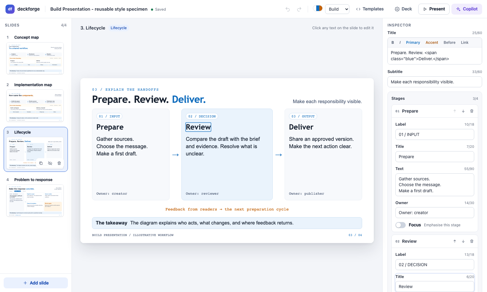
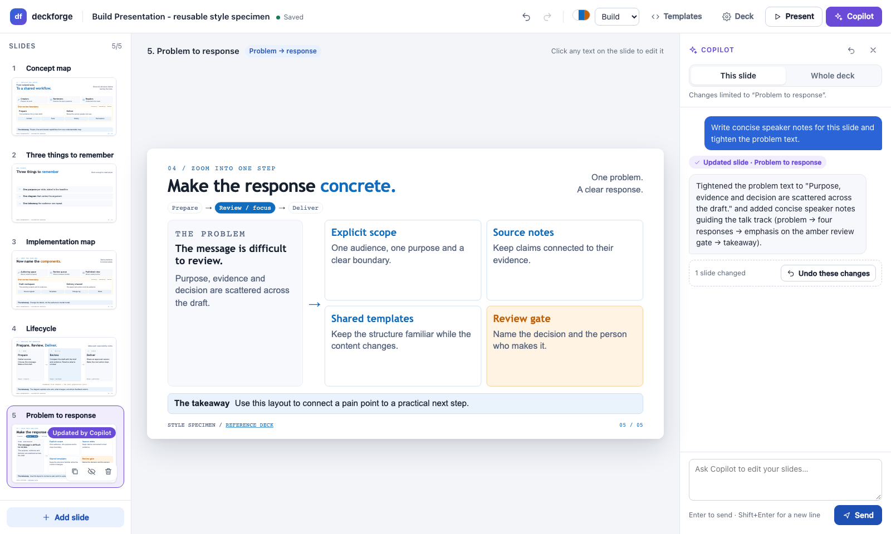
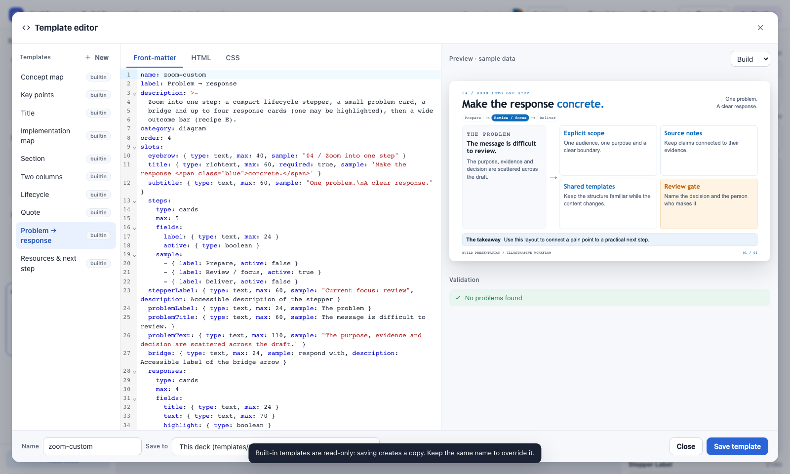
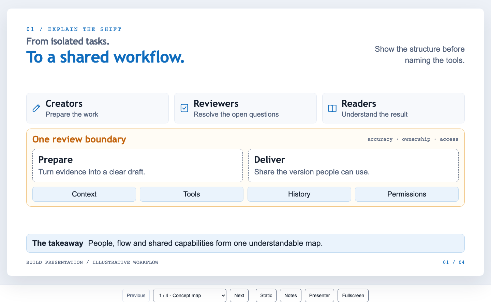

# deckforge

Themeable, template-driven HTML presentations with a static **viewer**, a local
**editor**, a **template editor** and an embedded **GitHub Copilot** assistant.

deckforge keeps the look of the `build-presentation` style (white 16:9 slides,
blue and amber accents, diagram-led layouts, staged reveals). Instead of
hand-editing raw HTML, you describe the deck in `deck.yaml` and deckforge
generates a static `deck.html`:

- **Viewer**: a static `deck.html` with keyboard and hash navigation, a static/reduced-motion
  mode, speaker notes, a presenter window, fullscreen and print output. It stays
  readable without JavaScript and makes **no network requests** in the `local` and `inline`
  runtime modes.
- **Editor** (`deckforge edit`): a slide rail, a live preview with inline text editing, a typed slot
  inspector, a theme switcher, autosave and undo/redo.
- **Copilot**: a chat drawer scoped to *this slide* or the *whole deck*. Copilot can only call deck tools, and
  each turn is one undo step.
- **Template editor**: front-matter, HTML and CSS editing with a live preview, plus validation (unknown
  slots, overflow at 1280×720).



| Copilot drawer | Template editor | Viewer |
|---|---|---|
|  |  |  |

## Install

You need Node.js **20.19 or later**, or **22.12 or later**.

```bash
# from GitHub (the built runtime in dist/ is committed)
npm install -g github:lrivallain/deckforge
# or run it without installing
npx github:lrivallain/deckforge --help
```

The Copilot assistant uses the optional dependency `@github/copilot-sdk`, which
bundles the Copilot runtime (about 100 MB). It installs by default. For a slim install
that can only build and edit decks, use `npm install --omit=optional`. In that case the assistant
explains how to add the SDK.

## Quick start

```bash
deckforge new my-talk --title "Shipping with confidence"   # creates my-talk/deck.yaml + deck.html
deckforge edit my-talk                                      # opens the editor in your browser
deckforge build my-talk --runtime inline                    # one self-contained deck.html
```

To start from the full specimen deck, run `deckforge new my-talk --example`. It is the same deck as
[`examples/starter`](examples/starter), which reproduces the `build-presentation`
`starter.html` pixel for pixel.

## CLI

| Command | What it does |
|---|---|
| `deckforge new <dir> [--title T] [--theme build] [--example] [--force]` | Create a deck folder with `deck.yaml` and build it |
| `deckforge build <deck.yaml\|dir> [--runtime local\|cdn\|inline] [--out file]` | Render `deck.yaml` to `deck.html`. Prints validation issues; exits with code 2 on errors |
| `deckforge edit <deck.yaml\|dir> [--port 0] [--token T] [--runtime …] [--no-open]` | Start the local editor |
| `deckforge serve <deck.yaml\|dir> [--port 0] [--no-open]` | Serve the deck read-only. Rebuilds and live-reloads on change |

`edit` and `serve` bind to `127.0.0.1` only. `edit` prints a URL with a per-run
token, for example `http://127.0.0.1:53712/?token=…`. That URL is the only way into the editor,
so do not share it.

## `deck.yaml`

`deck.yaml` is the source of truth. `deck.html` is generated, so do not edit it by hand.

```yaml
meta:
  title: Shipping with confidence
  lang: en                    # BCP 47, used for <html lang>
  theme: build                # a theme name (see Themes)
  footer: Platform team / Q3  # rich text shown in every slide footer
  runtime: local              # optional: local | cdn | inline
  brief:                      # grounds the Copilot assistant
    topic: Release safety
    audience: Engineering managers
    goal: Agree on one release gate
    duration: 20 minutes
    sources: [Q3 incident review]
slides:
  - id: shift                 # stable id: letters, digits, dashes
    template: concept-map     # a template name (see Templates)
    title: Concept map        # optional navigation title
    hidden: false             # hidden slides are kept but not presented
    footer: optional per-slide footer override (rich text)
    notes: |
      Speaker notes. Blank lines separate paragraphs.
    data:                     # slot values defined by the template
      eyebrow: 01 / Explain the shift
      title: <span class="old">From X.</span><span class="blue">To Y.</span>
      audiences:
        - { icon: pen, title: Creators, text: Prepare the work }
```

Two optional per-slide fields are managed by the editor:

- `placeholders`: slots that still contain the template's sample text, for example after adding a slide
  or switching templates. The editor shows them as dimmed "Sample" placeholders. They are **never
  published** in `deck.html`, and a required slot left as a placeholder is reported as an issue.
  Editing a slot makes it real content.
- `stash`: content of slots the current template does not use. When you switch templates, nothing is
  lost: switching back to a template with those slots restores them. A navigation `title` that only
  repeated the old template's name is dropped, so the title follows the headline.

The editor rewrites `deck.yaml` on every change, so YAML comments are not preserved.
External edits, for example from your text editor, are picked up live and can be undone.

## Themes

A theme is a YAML file that compiles to CSS custom properties (`--df-*`).
deckforge looks up themes in this order:

1. `<deck folder>/themes/<name>.yaml`
2. `~/.config/deckforge/themes/<name>.yaml` (or `$XDG_CONFIG_HOME/deckforge`, or `$DECKFORGE_CONFIG_DIR`)
3. the built-in themes:
   - **`build`** has the exact `build-presentation` tokens.
   - **`atelier`** is a warm ivory theme with teal and rose accents and serif headings.

```yaml
name: my-theme
label: My theme
palette:            # required: bg paper line ink muted node primary primary-soft primary-line accent accent-soft accent-line
  bg: "#EDF1F7"     # optional: frame (boundary fill), dashed (dashed borders), ok, chrome (viewer surround),
                    #   accent-text / primary-text (darker shades for small text, 4.5:1 contrast)
  paper: "#FFFFFF"
  # …
fonts:
  heading:
    family: Bricolage Grotesque
    fallback: '"Trebuchet MS", "Segoe UI", sans-serif'
    faces:
      - { weight: 800, local: [Bricolage Grotesque ExtraBold Regular] }
      - { weight: 600, url: fonts/heading-600.woff2 }   # relative to deck.html, or https://
  body: { family: Instrument Sans, fallback: '"Segoe UI", Arial, sans-serif' }
  mono: { family: IBM Plex Mono, fallback: Consolas, monospace }
radii:   { slide: 12px, card: 10px, panel: 12px, frame: 14px, small: 8px, pill: 99px }
spacing: { padding: 3cqw 4cqw 2cqw, gap: 1.3cqw, grid: 1.1cqw }
motion:  { duration: .55s, easing: ease, distance: 8px, stagger: .15s }
shadow:  { slide: 0 24px 60px rgb(22 32 47 / 10%) }
```

Values are validated, and anything that could break out of CSS is rejected. Fonts are not
bundled. The built-in themes use locally installed fonts with named fallbacks, so they make no network requests.

## Templates

A template is one `.html` file with YAML front-matter, an HTML body and scoped CSS.
The lookup order is the same as for themes: `templates/` in the deck folder, then
`~/.config/deckforge/templates/`, then the built-ins.

```html
---
name: team-grid                 # must match the file name
label: Team grid
description: Up to three cards under a headline.
category: content               # structure | diagram | content (template picker groups)
order: 10                       # optional sort order in the picker
class: map-slide                # optional extra classes on the <section>
slots:
  eyebrow: { type: text, max: 40, sample: "Section / topic" }
  title:   { type: richtext, max: 60, required: true, sample: 'A clear <span class="blue">headline</span>' }
  cards:
    type: cards
    max: 3                      # characters for text, items for list/cards (soft limit)
    fields:
      icon:  { type: icon }
      title: { type: text, max: 24 }
      focus: { type: boolean }
    sample:
      - { icon: users, title: First }
---
<header class="header reveal">
  <div><p class="eyebrow">{{eyebrow}}</p><h1 id="{{slide.titleId}}">{{title}}</h1></div>
</header>
<div class="grid">
  {{#each cards}}<article class="card{{#if focus}} focus{{/if}} reveal">{{icon}}<h2>{{title}}</h2></article>{{/each}}
</div>
{{> foot}}

<style scoped>
.grid { flex: 1; display: grid; grid-auto-flow: column; grid-auto-columns: minmax(0, 1fr); gap: var(--df-space-grid); }
:scope .header { flex: 0 0 9cqw; }   /* :scope = this template's slide */
</style>
```

**Slot types**

| Type | Value | Notes |
|---|---|---|
| `text` | string | HTML-escaped. Newlines become `<br>` |
| `richtext` | string | Sanitized inline HTML: `b strong i em u s small sub sup code kbd br span a abbr`. Allowed classes: `old muted primary accent blue amber ok mono nowrap`. Links only allow `http(s)`, `mailto`, `#` and relative URLs |
| `list` | string[] | Use `of: text \| richtext`. `maxLength` limits each item |
| `cards` | object[] | `fields` declares the slot type of each item field |
| `icon` | icon name | One of the built-in outline icons, such as `pen review book user users shield lock cloud server database code gear chart target flag idea rocket link search clock calendar mail chat globe layers box bolt check alert arrow star heart home file folder eye sparkles puzzle flow agent network money building` |
| `link` | `{label, href}` | Rendered as a safe external link |
| `boolean` | true/false | Use it in `{{#if}}` blocks |

**Syntax**

- `{{slot}}` outputs a value. Text is escaped and rich text is sanitized. Inside an attribute, the value becomes plain text.
- `{{#each slot}}…{{else}}…{{/each}}` loops over a list. Inside the loop, use `{{this}}`, `{{field}}`, `{{@index}}`, `{{@number}}` (01, 02…), `{{@first}}` and `{{@last}}`.
- `{{#if slot}}…{{else}}…{{/if}}` and `{{#unless slot}}…{{/unless}}` render conditionally.
- `{{slide.number}} {{slide.total}} {{slide.titleId}} {{slide.footer}}` and `{{deck.title}} {{deck.author}} {{deck.date}}` output deck metadata.
- `{{> foot}}` renders the standard footer. `{{! comment }}` is a comment.
- `<style scoped>` scopes every selector to `.df-t-<name>`.
- Add `class="reveal"` for staged entrances. The viewer staggers delays in reading order unless you set `style="--delay:.3s"`.

The viewer CSS provides a base kit with the classes `header eyebrow subtitle outcome foot pill card
icon arrow`, `h1 .old`, `.blue/.primary` and `.amber/.accent`. Built-in templates:
`title`, `section`, `concept-map`, `implementation-map`, `lifecycle`, `zoom`
(problem → response), `bullets`, `two-column`, `quote` and `resources`.

## Runtime modes and CDN

`deck.html` loads the viewer runtime (`deckforge.viewer.js` and `.css`) in one of three ways:

| Mode | How | Network |
|---|---|---|
| `local` (default) | Copies `deckforge/deckforge.viewer.{js,css}` next to `deck.html` | none |
| `inline` | Embeds everything in a single self-contained file | none |
| `cdn` | `https://cdn.jsdelivr.net/gh/lrivallain/deckforge@v<version>/dist/deckforge.viewer.{js,css}` | jsDelivr |

Theme and template CSS are always inlined, so `cdn` decks fetch only the two runtime files.
The CDN URLs only resolve for tagged releases (`v<version>`).

## Viewer

| Key | Action |
|---|---|
| → / PageDown / Space | Next slide |
| ← / PageUp | Previous slide |
| Home / End | First / last slide |
| `S` | Toggle static mode (no animations) |
| `N` | Toggle the speaker notes panel |
| `P` | Open the presenter window (notes, next slide, timer) |
| `F` | Toggle fullscreen |

The viewer also supports these:

- **Hash links:** `#3` and `#slide-<id>` open a specific slide.
- **Reduced motion:** with `prefers-reduced-motion`, slides show their final state immediately.
- **Print / PDF:** printing outputs one 13.333×7.5 in page per slide, without the controls.

## Editor

- **Slide rail.** Click to select a slide, or drag to reorder. Alt+↑/↓ moves a slide, Delete removes it and ⌘/Ctrl+D duplicates it.
  Each item has buttons to duplicate, hide/show and delete the slide.
- **Preview.** Click any text to edit it in place. Enter commits, Shift+Enter adds a line break and Esc reverts.
- **Inspector.** Template picker with live thumbnails, typed slot form (counters show the `max`
  limits), speaker notes, navigation title, footer override and visibility. Template changes are
  named in the undo history and in a toast, for example "Slide 1: Concept map → Title · Undo". Copilot's template
  changes are announced the same way.
- **Top bar.** Undo/redo (⌘/Ctrl+Z, ⇧⌘Z), theme switcher, **Templates** (template editor),
  **Deck** (metadata, brief, runtime), **Present** (opens the generated viewer) and **Copilot** (⌘/Ctrl+K).
- Every change autosaves `deck.yaml` and rebuilds `deck.html`.

### Copilot assistant

The assistant runs server-side through the [GitHub Copilot SDK](https://github.com/github/copilot-sdk)
and uses your existing sign-in from `gh auth login` or the Copilot CLI `/login`. If you are not
signed in, the drawer shows how to sign in.

- **Scope.** *This slide* limits every change to the selected slide. *Whole deck* allows
  adding, removing, reordering and theming slides.
- **Tools.** Copilot can only use `get_deck`, `list_templates`, `list_themes`, `update_slide`,
  `add_slide`, `remove_slide`, `move_slide`, `set_hidden`, `set_template`, `set_theme` and
  `update_meta`. It has no shell, file or web tools. Every other permission request is refused.
- **Grounding.** The system prompt contains the design rules of the style (one takeaway per slide,
  short headlines, no invented facts…), the template catalogue and `meta.brief`.
- **Undo.** Changes apply directly, and slides Copilot changed are highlighted in the rail. A turn is a single
  undo step ("Undo these changes").
- **Model.** Set `DECKFORGE_MODEL=<model>` to pick a model. By default, deckforge uses the Copilot default model.

### Security model

- The server binds `127.0.0.1` with a random port and a per-run token. The token is exchanged for an
  `HttpOnly; SameSite=Strict` cookie.
- The server checks the Host header against DNS rebinding and the Origin header on writes. It requires JSON request bodies and sends
  a strict Content-Security-Policy for the editor.
- Writes happen only in the deck folder (`deck.yaml`, `deck.html`, `deckforge/`, `templates/`) and in
  `~/.config/deckforge/templates`. Dot-files and paths outside the deck folder are never served.
- Slot text is HTML-escaped and rich text is sanitized with an allow-list. Theme values are validated.
- deckforge sends no telemetry.

## Development

```bash
npm ci                  # behind a private mirror, keep the lockfile URLs as generated
npm run build           # esbuild → dist/deckforge.{viewer,editor}.{js,css}
npm test                # vitest unit tests (core, server, agent with a mocked SDK, CLI)
npm run test:e2e        # Playwright (Chromium + WebKit): viewer a11y/print/no-JS, editor flows, agent (mocked SDK)
npm run lint
npm run dev             # rebuild on change + `deckforge edit` on a scratch copy of the example (port 4370)
```

Editor previews are written into same-origin `about:blank` iframes with `document.write`. They do not use
`srcdoc` or `blob:` URLs, which some WebKit hosts (for example Tauri WKWebView) never load. An e2e test
disables `srcdoc` to guard this.

`dist/` and `examples/starter/deck.html` are committed, because the CDN serves them from Git tags.
CI checks that they are up to date. The e2e tests mock the Copilot SDK with
`test/fixtures/mock-sdk.js` (`DECKFORGE_AGENT_MOCK`).

## Limitations

- PowerPoint export is out of scope. Use your existing HTML→PPTX workflow on `deck.html`.
- The editor does not preserve YAML comments in `deck.yaml`.
- There is no image slot type yet. Templates can still reference images in the deck folder.
- Fonts are not bundled. The `build` theme falls back to system fonts when its fonts are not installed.

## License

[MIT](LICENSE)
